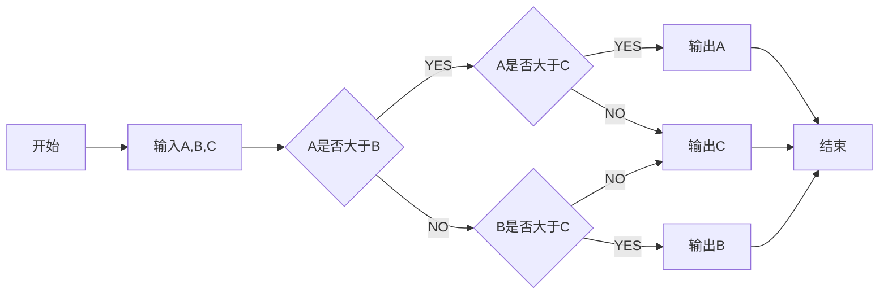

<head>
    
    
</head>

# 摆线

## 参数方程

$$
\begin{cases}
x=r(t-\sin t) \\
y=r(1-\cos t) \\
\end{cases}
$$

## 一般方程

消去$ \cos t $：

$$
\cos t=1-\frac{y}{r}
$$

消去t

$$
t=\arccos(1-\frac{y}{r})
$$

消去$ \sin t $：

$$
\begin{align}
\sin t
&=t-\frac{x}{r} \\
&=\arccos(1-\frac{y}{r})-\frac{x}{r}
\end{align}
\tag{3}
$$

则有

$$
\begin{align}
\sin^{2}t+\cos^{2}t
&=(\arccos(1-\frac{y}{r})-\frac{x}{r})^{2}+(1-\frac{y}{r})^{2} \\
&=1
\end{align}
$$

即

$$
(r\arccos(1-\frac{y}{r})-x)^{2}+y(y-2r)=0
$$

## 微分方程

$$
(\frac{\mathrm{d} y}{\mathrm{d} x})^{2}
=\frac{2r}{y}-1
$$

推导过程

$$
\begin{align}
(\frac{\mathrm{d} y}{\mathrm{d} x})^{2}
&=(\frac{\frac{\mathrm{d}y}{\mathrm{d}t}}{\frac{\mathrm{d}x}{\mathrm{d}t}})^{2} \\
&=(\frac{r\sin t}{r(1-\cos t)})^{2} \\
&=\frac{\sin^{2} t}{(1+\cos t)^{2}} \\
&=\frac{1-\cos t}{1+\cos t} \\
&=\frac{2}{1-\cos t}-1 \\
&=\frac{2r}{y}-1
\end{align}
$$
